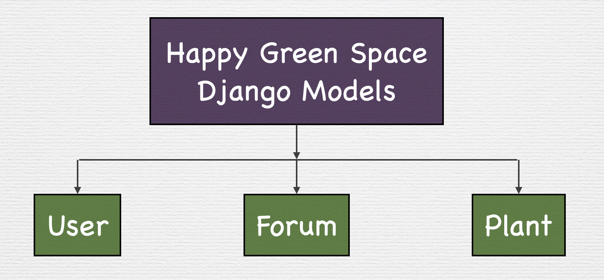
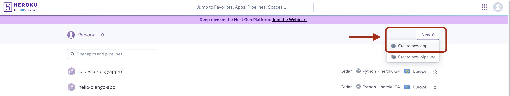
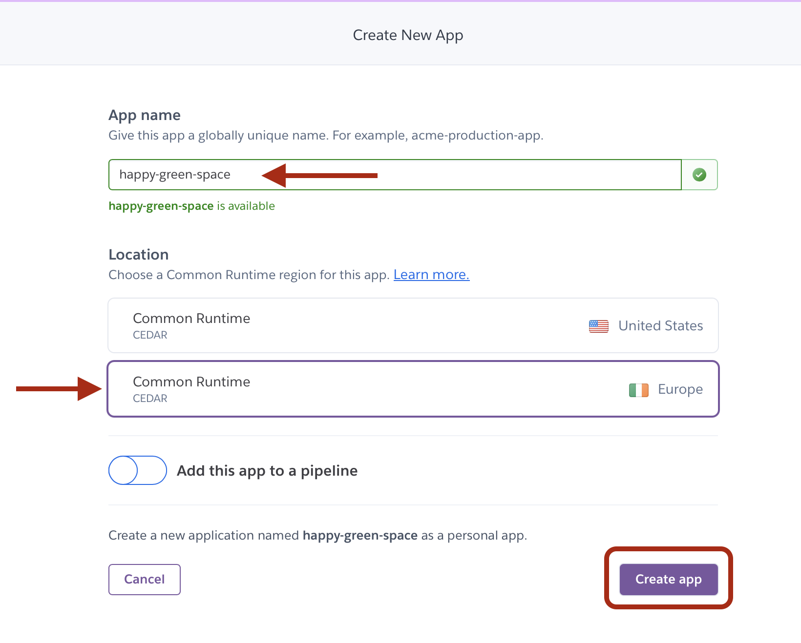
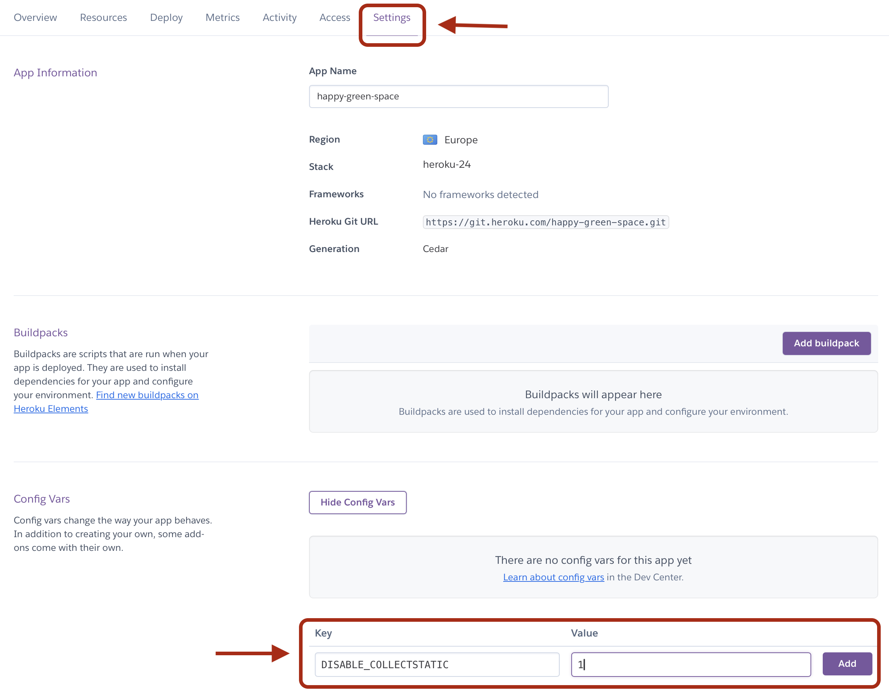
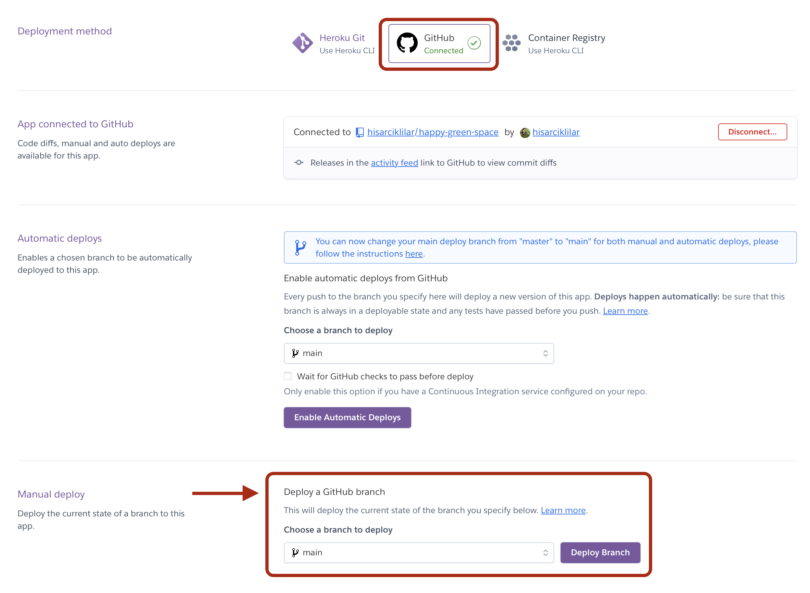
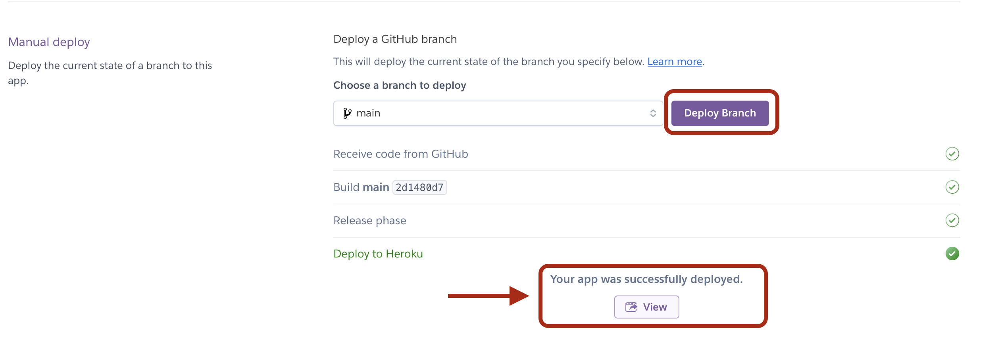
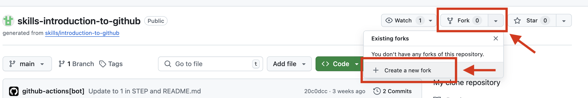
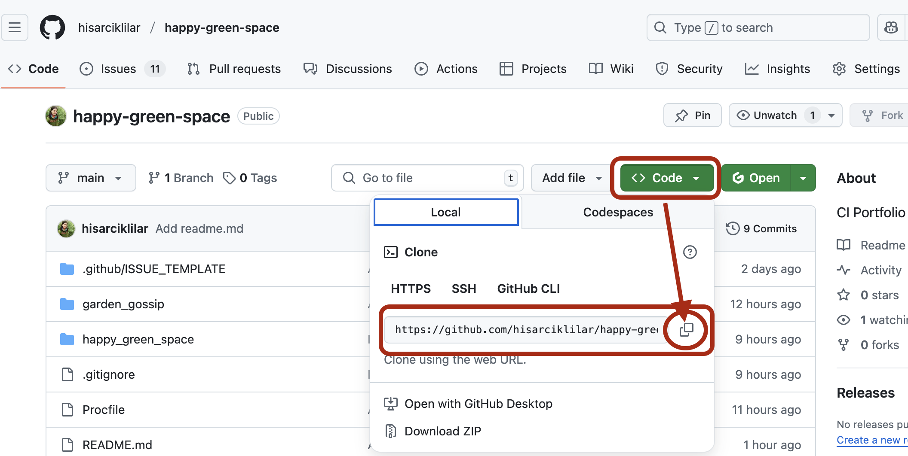

# Happy Green Space

Happy Green Space is a web-based platform that aims to bring the following functionalities together in one space:

- The ability for the users to register to the platform and login
- The ability for the users to enter and store particular information about their plot/garden and what plants they have planted.
- The ability for the users to search and obtain information about plants
- The ability for users to join a conversation through a platform forum. 
- Regular updates of a page which provides information about the specific tasks to undertake in each month of the year.

With all these functionalities, the platform target to function as a home page for allotment users.

## App's Location

- Happy Green Space Live Link:
  - <https://happy-green-space-94f206e157cb.herokuapp.com>

- happy-green-space GutHub Repository:
  - <https://github.com/hisarciklilar/happy-green-space>
  
## User Experience

Happy Green Space is a platform targeting allotment users, although people who do gardening may also use it.

## User Stories

_**Account creation**_:

As a **Site User** I can **create/register an account** so that **I can participate in the plot holders' forum and also have my own account space where I can save a list of my plants and a wish list**.

-   **AC1** Given an email a user can register an account.\
-   **AC2** Then the user can log in.\
-   **AC3** When the user is logged in they can read posts in the forum.\
-   **AC4** When the user is logged in they can effectively use their personal space to create, edit and delete plant entries.

_**Read a post**_:

As a **Site User**, I can **read posts on the plot holders' forum** so that **I can join the conversation**.

-   **AC1** When the user is logged in, they can see and read the posts in the forum

_**Create a post**_:

As a **Site User**, I can **create posts on the plot holders' forum** so that **I can join the conversation**.

-   **AC1** When the user is logged in, they can create posts in the forum

_**Edit or delete a post**_:

As a **Site User**, I can **edit / delete my own posts on the plot holders' forum** so that **I can join the conversation**.

-   **AC1** When the user is logged in, they can edit (modify) their own posts in the forum
-   **AC2** When the user is logged in, they can delete their own posts in the forum

_**Delete a post (admin)**_:

As a **Site Admin** I can **delete posts of platform users** so that **I can remove offensive content**.

-   **AC1** When the admin is logged in, they can view the posts in the forum.

-   **AC2** When the admin is logged in, they can delete or edit posts in the forum.

_**Update plant database**_:

As a **Site Admin** I can **update the platform's plant database by adding new entries, editing existing ones and deleting entries when necessary** so that **the Site Users have a satisfactory search experience**.

-   **AC1** When the admin is logged in, they can add items to the plant database

-   **AC2** When the admin is logged in, they can modify the entries in the plant database

-   **AC3** When the admin is logged in, they can remove entries from the plant database

_**Follow platform searches**_:

As a **Site Admin** I can **see which plants are searched for in the platform** so that **I can prioritize addition of most commonly searched plants into the platform's plant database**.

-   **AC1** When the admin is logged in, they can see a list of searched items
-   **AC2** When the admin is logged in, they can see the date that the search was conducted
-   **AC3** When the admin is logged in, they can see the location that the search was conducted

_**Maintain a wish list**_:

As a **Site User**, I can **maintain a wish list** so that **I can easily remember the name of plants I like and I can better plan what to grow in the future.**

-   **AC1** Given a logged user, they can create a wish list

-   **AC2** Given a logged user, they can add items to the wish list

-   **AC3** Given a logged user, they can delete items from the wish list

-   **AC4** Given a logged user, they can edit list of items in the wish list

_**Create a visual representation of user's plot**_:

As a **Site User** I can **enter and save approximate measurements of my allotment/garden plot** so that **I can mark on a visual representation of my plot the plants I planted**.

-   **AC1** Given a logged user, they can see a rough visual (rectangular) representation of their plot

-   **AC2** Then they can mark on the plot where they planted

-   **AC3** Then they can mark on the plot what they planted

_**Keep a record of plantations**_:

As a **Site User**, I can **keep a record of plants I planted and the dates I planted them** so that **I can remember what harvest to expect and better plan future actions.**

-   **AC1** Given a logged user, they can create a list of planted plants

-   **AC2** Given a logged user, they can add items to the wish list

-   **AC3** Given a logged user, they can delete items from the wish list

-   **AC4** Given a logged user, they can edit list of items in the wish list

_**Obtain information about plants**_:

As a **Site User** I can **get information about plants I search on the platform** so that **I can make informed decisions on what to plant and to which spot in my plot**

-   **AC1** User can easily locate the search button

-   **AC2** User can enter plant's name in the search field

-   **AC3** User can press the search button, which triggers a search in the database

-   **AC4** User can see search results on screen

## Existing Features

The platform curently consists of 3 apps:
- Users
- Main
- Forum
- Plants

The Users app has the functionality of user registration and login

The Main app hosts the static pages such as the base template, the homepage, the about page, and the taks of the month page. 

The Forum app allows users to post in the forum and also reply to others' posts

The Plants app allows users to create a list of plants they planted, takes notes about the plant also state whether or not they are happy with the outcome. 

### Main

The static pages hosted in the main app include: 

- home : This is the home page for the platform. It provides breif information about the functionality of the platform and provides links to other pages and apps.  
- about : Provides brief information abour the Happy Green Space platform
- tasks for the month: this page currently provides information about the nature in January and gardening tasks to undertake in this month. It is currently provided as a placeholder for further development. Links for each month will be added at later stages. This space can also later be converted into blog type model where users can contribute with blogs on monthly tasks or community activities.  

### Forum

This is the space for garden gossip! Allotment users usually like sharing information with others about plants and tips for success. The platform will provide users with a forum space where they communicate with each other.

### Plants

A good planting planning requires plot holders to make notes about what they planted and where. Hand-written notes are likely to get lost or take time to organize. The platform provides plot holders with a digital space where they can easily make lists of their plants as well as taking notes about their plants and mark whether or not the plant grew well.  

## Templates 

Templates are organised within individual Django apps to maintain a clear seperation and transferability. 
The core `main` app provides the base layot and statis pages, which are then extended by feature-specific apps. 

## Data Model

The Django Database Structure consists of three models: `User`, `Forum` and `Plant`. This is represented by the Entry Relationship Diagram below.

### Database Relationships

__The USER Model__

| **Key**    | **Name**    | **Type**     | **Extra Info**                   |
|------------|-------------|--------------|----------------------------------|
| PrimaryKey | username    | CharField    | max_length=50, unique=True       |
|            | first_name  | CharField    | max_length=50                    |
|            | last_name   | CharField    | max_length=50                    |
|            | email       | EmailField   | max_length=200                   |
|            | password    | CharField    |                                  |
|            | plot_width  | IntegerField |                                  |
|            | plot_length | IntegerField |                                  |
|            | location    | CharField    |                                  |
| ForeignKey | plant       | Plant Model  |                                  |
|            | plant_wish  | CharField    | *could be linked to Plant Model* |
| ForeignKey | post        | Forum Model  |                                  |

__The FORUM Model__

| **Key**    | **Name**  | **Type**      | **Extra Info** |
|------------|-----------|---------------|----------------|
| ForeignKey | username  | User Model    |                |
|            | title     | CharField     |                |
| PrimaryKey | post      | TextField     | blank=False    |
|            | posted_on | DateTimeField | auto_now=True  |

__The PLANT Model__

| **Key**     | **Name**    | **Type**     | **Extra Info** |
|-------------|-------------|--------------|----------------|
| Primary Key | plant_name  | CharField    |                |
|             | genus       | CharField    |                |
|             | cultivar    | CharField    |                |
|             | type        | IntegerField | choices=TYPE   |
|             | height      | IntegerField |                |
|             | width       | IntegerField |                |
|             | description | TextField    |                |
|             | image       | ImageField   |                |
| ForeignKey  | username    | User Model   |                |

## Future Features

### WikiPlant

Plot holders usually experiment with planting a variety fruit, herb or vegetables but sometimes they may not know enough about different plants, in particular when they are newbies. WikiPlant pages will allow users to search for plants and obtain information about when to plant, where, what harvest to expect, etc.

### My allotment

A good planting planning requires plot holders to make notes about what they planted and where. These notes are likely to get lost or take time to organize. Markings left on the planting spots usually get lost too due to rain, wind, or some other external factors. The platform may provide plot holders with a digital representation of their allotment space where they can mark on the digital allotment map what plants are planted, where. 

### Tasks of the month

This space provides information about the gardening tasks that are recommended to take place in each month.

### Integration of Predictive Algorithms

- Analysis of the most popular plants planted by the users in a location
- Analysis of the success rates of plants planted by users in a location
   
## Testing

*To be added*

## Deploying the App on Heroku

### In the local project folder:

1.  Install `gunicorn` by running `pip install gunicorn~=20.1` from the terminal

2.  Add this installation to the requirements file by running `pip freeze --local > requirements.txt`

3.  Create a `Procfile` at the root directory of the project, declaring the process as `web` and adding a start command. The`Procfile` should then read `web: gunicorn happy_green_space.wsgi`

4.  In the `happy_green_space/settings.py` set the `DEBUG` constant to `False`. Append the `'.herokuapp.com'` hostname to the `ALLOWED_HOSTS` list.

5.  Update Git Repository

### In the Heroku account:

6.  In the Heroku account dashboard, create new app choosing Europe as the location.

    

    

7.  From the `Settings`, `Config Vars` section, create a `key` of `DISABLE_COLLECTSTATIC` with `value` of `1`

    

8.  In `Deploy`, after providing GitHub Repository details, click on `Deploy Branch` in the `Manual deploy` section.

    

    

9.  You may view the page once the deployment is completed.

    

## Creating a Fork

On GitHub, users may fork this repository by navigating to "Fork" and selecting "Create a new fork". One cannot fork from their repository. Hence, below, a screenshot of how this could be done is provided using a repository created by a different user:

## Cloning a Repository

Users may clone this repository by navigating to "Code" and copying the clone link. This link can then be used in Gitpod or a local code editor. A screenshot of the links is provided below:

(Please note this is not the only way to clone a repository)

## Acknowledgements

- ChatGPT for error identification and potential solutions while working on the platform.
- ChatGPT for creation of text about tasks to undertake in January (`tasks_january.html`) file. 
- Leaves pattern used at the background is downloaded from <https://www.toptal.com/designers/subtlepatterns/leaves/>

## References
- Severence, C. (n.d.) Django for Everybody. Online course available from <https://www.dj4e.com>
- Vincent, W.S. (2025) Django for Beginners, 5th ed. Still River Press. 
- Vincent, W.S. (2025) Django for Professionals, 5th ed. Available from <https://learndjango.com/courses/django-for-professionals/> with subscription. 