# Happy Green Space

Happy Green Space is a web-based platform that aims to bring together a set of functionalities in one place that gives the users the ability to: 

- register to the platform and login
- enter and store particular information about their plot/garden
- enter and store information about what plants they have planted, when and the success of the yield
- make suggestions for plant entries to be included in the global (platform-level) database
- search and obtain information about plants
- join a conversation through a platform forum where they can post and reply others
- access information about the specific tasks to undertake in each month of the year.

With all these functionalities, the platform target to function as a home page for allotment users.

## App's Location

- Happy Green Space Live Link:
  - <https://happy-green-space-94f206e157cb.herokuapp.com>

- happy-green-space GutHub Repository:
  - <https://github.com/hisarciklilar/happy-green-space>
  
## User Experience

Happy Green Space is a platform targeting allotment users and gardeners helping them in their gardening tasks.

## User Stories

_**Account creation**_:

As a **Site User** I can **create/register an account** so that **I can participate in the plot holders' forum and also have my own account space where I can save a list of my plants and a wish list**.

-   **AC1** User can register an account by providing a user name and password.
-   **AC2** Then the user can log in.
-   **AC3** When the user is logged in they can read posts & replies in the forum.
-   **AC4** When the user is logged in they can effectively use their personal space to create, edit and delete plant entries.

_**Read a post**_:

As a **Site User**, I can **read posts and replies on the plot holders' forum** so that **I can join the conversation**.

-   **AC1** When the user is logged in, they can see and read the posts in the forum

_**Create a post**_:

As a **Site User**, I can **create posts on the plot holders' forum** so that **I can join the conversation**.

-   **AC1** When the user is logged in, they can create posts in the forum

_**Edit or delete a post**_:

As a **Site User**, I can **edit / delete my own posts on the plot holders' forum** so that **I can join the conversation**.

-   **AC1** When the user is logged in, they can edit (modify) their own posts in the forum
-   **AC2** When the user is logged in, they can delete their own posts in the forum

_**Delete a post (admin)**_:

As a **Site Admin** I can **delete posts of platform users** so that **I can remove offensive content**.

-   **AC1** When the admin is logged in, they can view the posts in the forum.

-   **AC2** When the admin is logged in, they can delete or edit posts in the forum.

_**Update plant database**_:

As a **Site Admin** I can **update the platform's plant database by adding new entries, editing existing ones and deleting entries when necessary** so that **the Site Users have a satisfactory search experience**.

-   **AC1** When the admin is logged in, they can add items to the plant database

-   **AC2** When the admin is logged in, they can modify the entries in the plant database

-   **AC3** When the admin is logged in, they can remove entries from the plant database

As a **Site Admin** I can **update the platform's plant database by reviewing, editing, and approving the plant suggestions of the platform users** so that **the Site Users can contribute to the development of a platform-level plant database**.

-   **AC1** When the admin is logged in, they can review plant suggestion forms submitted by logged in platform users

-   **AC2** When the admin is logged in, they can modify the plant suggestion forms submitted b logged in platform users

-   **AC3** When the admin is logged in, they can approve or reject the plant suggestions submitted bby platform users

_**Follow platform searches**_:

As a **Site Admin** I can **see which plants are searched for in the platform** so that **I can prioritize addition of most commonly searched plants into the platform's plant database**.

-   **AC1** When the admin is logged in, they can see a list of searched items
-   **AC2** When the admin is logged in, they can see the date that the search was conducted
-   **AC3** When the admin is logged in, they can see the location that the search was conducted

_**Maintain a wish list**_:

As a **Site User**, I can **maintain a wish list** so that **I can easily remember the name of plants I like and I can better plan what to grow in the future.**

-   **AC1** Given a logged user, they can create a wish list

-   **AC2** Given a logged user, they can add items to the wish list

-   **AC3** Given a logged user, they can delete items from the wish list

-   **AC4** Given a logged user, they can edit list of items in the wish list

_**Create a visual representation of user's plot**_:

As a **Site User** I can **enter and save approximate measurements of my allotment/garden plot** so that **I can mark on a visual representation of my plot the plants I planted**.

-   **AC1** Given a logged user, they can see a rough visual (rectangular) representation of their plot

-   **AC2** Then they can mark on the plot where they planted

-   **AC3** Then they can mark on the plot what they planted

_**Keep a record of plantations**_:

As a **Site User**, I can **keep a record of plants I planted and the dates I planted them** so that **I can remember what harvest to expect and better plan future actions.**

-   **AC1** Given a logged user, they can create a list of planted plants

-   **AC2** Given a logged user, they can add items to the wish list

-   **AC3** Given a logged user, they can delete items from the wish list

-   **AC4** Given a logged user, they can edit list of items in the wish list

_**Obtain information about plants**_:

As a **Site User** I can **get information about plants I search on the platform** so that **I can make informed decisions on what to plant and to which spot in my plot**

-   **AC1** User can easily locate the search button

-   **AC2** User can enter plant's name in the search field

-   **AC3** User can press the search button, which triggers a search in the database

-   **AC4** User can see search results on screen

_**Obtain information about monthly tasks**_:

As a **Site User** I can **get information about monthly gardening tasks** so that **I can keep up with the work I need to complete on time**

-   **AC1** User can visit the monthly tasks link

-   **AC2** User can read the monthly gardening-related tasks

_**Perform a keyword search on post and replies in the forum**_:

As a **Site User** I can **perform a keyword search on post and replies in the forum** so that **I can check for information in previously published posts/replies**

-   **AC1** User can find the search button easily

-   **AC2** User can enter a keyword in the search field

-   **AC3** User can see the results of a keyword search

-   **AC4** User can visit the post/reply from the keyword search results list

_**Add an image (or images) to post and replies in forum**_:

As a **Site User** I can **add images to posts and/or replies in the forum** so that **I can better communicate with other users of the platform**

-   **AC1** User can locate upload image button easily when posting or replying

-   **AC2** User can upload images to share

-   **AC3** User can share images within a post/reply

_**Add an image (or images) to post and replies in forum**_:

As a **Site User** I can **add images to my garden journal** so that **I can better remember the details of my plot / garden and plants**

-   **AC1** User can locate upload image button easily in "my garden" personal space

-   **AC2** User can upload images

-   **AC3** User can delete images when they are no longer required

## Existing Features

The Happy Green Space platform currently consists of three main applications:

- main
- forum
- my_garden

The `main` app hosts the static pages such as the base template, the homepage, the about page, and the tasks of the month page.

The `forum` app allows users to post in the forum and also reply to others' posts - with CRUD functionality.

The `my_garden` app allows users to create and list entries at the platform and user level. At the platform level, users can suggest plants to be included in the plant database - accessible by all platform users - and list this database. At the user level the app has CRUD functionality. Logged in users can create/list/edit/delete multiple plot entries for their garden/allotment and create/list/edit/delete a record of plantings in the respective plots that they have.

## Models, Views, Templates

Templates are organised within individual Django apps to maintain a clear separation and transferability.
The core `main` app provides the base layout and static pages, which are then extended by feature-specific apps.
The project heavilty relies on class-based views. 

### Main

The static pages hosted in the main app include:

- base: Base template for the pages in the platform to ensure consistency throughout. It includes the common navigation bar and footer.
- home : This is the home page for the platform. It provides brief information about the functionality of the platform and provides links to other pages and apps.  
- about : Provides brief information about the Happy Green Space platform
- tasks for the month: this page currently provides information about the nature in January and gardening tasks to undertake in this month. It is currently provided as a placeholder for further development. Links for each month will be added at later stages. This space can also later be converted into blog type model where users can contribute with blogs on monthly tasks or community activities.  

### Forum

This is the space for garden gossip! Allotment users usually like sharing information with others about plants and tips for success. The platform provides users with a forum space where they communicate with each other.

It consist of the `Post` and `Reply` models.

The templates in the app include:

- `Post Views`: post_list, post_detail, post_form, post_confirm_delete
- `Reply Views`: reply_form, reply_confirm_delete

### My Garden

A good planting planning requires plot holders to make notes about what they planted and where. Hand-written notes are likely to get lost or take time to organize. The platform provides plot holders with a digital space where they can easily make lists of their plots and record plantings as well as taking notes about the plants.  

It consists of the following models:`Plant`, `GardenPlot`, `PlantLog`, `WishList`, `ToDoItem`.

The templates in the app include:

- `PlantList Views`: plant_form, plant_list, plant_detail
- `GardenPlot Views`: gardenplot_form, gardenplot_list, gardenplot_confirm_delete
- `PlantLog Views`: plantlog_form, plantlog_list, plantlog_confirm_delete
- `GardenPlotDetail View` (combines information from `GardenPlot` and `PlantLog` models): gardenplot_detail
- `MyGardenDashboard View`: dashboard

## Data Model

The Django Database Structure consists of the `my_garden` and `forum` applications. Both applications utilize Django's built-in `User` model for authentication and user management.

The Entity Relationship Diagram below demonstrates this.

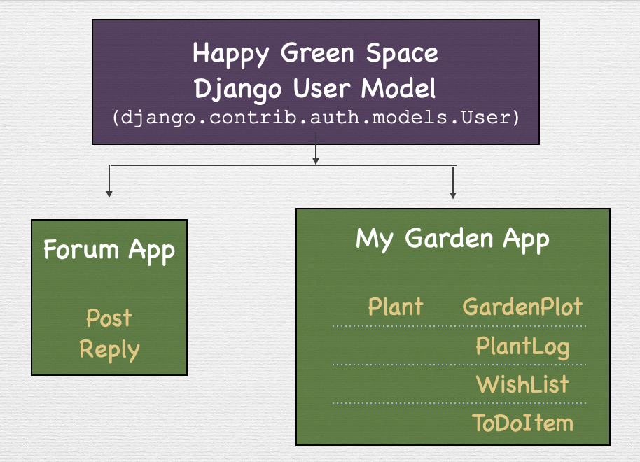

### Database Relationships

__The USER Model__

The project is using Django's built-in authentication system (`from django.contrib.auth.models import User`)

__The FORUM App : Post Model__

Represents discussion threads created by users.

| **Key**    | **Name**     | **Type**      | **Extra Info**                                    |
|------------|--------------|---------------|---------------------------------------------------|
| PrimaryKey | id           | AutoField     |                                                   |
|            | title        | CharField     | max_length=200                                    |
|            | slug         | SlugField     | max_length=200, unique=True                       |
|            | content      | TextField     |                                                   |
| ForeignKey | author       | User Model    | on_delete=CASCADE, related_name='forum_posts'     |
|            | created_on   | DateTimeField | auto_now_add=True                                 |
|            | edited_on    | DateTimeField | null=True, blank=True                             |

__The FORUM App : Reply Model__

Represents user responses to forum posts.

| **Key**    | **Name**     | **Type**      | **Extra Info**                                    |
|------------|--------------|---------------|---------------------------------------------------|
| PrimaryKey | id           | AutoField     |                                                   |
| ForeignKey | post         | Post Model    | on_delete=CASCADE, related_name='replies'         |
| ForeignKey | author       | User Model    | on_delete=CASCADE, related_name='commenter'       |
|            | body         | TextField     |                                                   |
|            | created_on   | DateTimeField | auto_now_add=True                                 |
|            | edited_on    | DateTimeField | null=True, blank=True                             |

__The MY GARDEN App : Plant Model__

Stores information about different plant species that users can track in their gardens.
Suggested by users, to be approved by the admin. Admin approval feature will be added at a later version of the project.

| **Key**    | **Name**          | **Type**              | **Extra Info**                                    |
|------------|-------------------|-----------------------|---------------------------------------------------|
| PrimaryKey | id                | AutoField             |                                                   |
|            | name              | CharField             | max_length=100                                    |
|            | scientific_name   | CharField             | max_length=150, blank=True                        |
|            | category          | CharField             | max_length=20, choices=CATEGORY_CHOICES, default='other' |
|            | use_type          | CharField             | max_length=10, choices=USE_CHOICES, default='unknown' |
|            | is_edible         | BooleanField          | default=False                                     |
|            | height_cm_min     | PositiveIntegerField  | null=True, blank=True                             |
|            | height_cm_max     | PositiveIntegerField  | null=True, blank=True                             |
|            | spread_cm_min     | PositiveIntegerField  | null=True, blank=True                             |
|            | spread_cm_max     | PositiveIntegerField  | null=True, blank=True                             |
|            | spacing_cm        | PositiveIntegerField  | null=True, blank=True                             |
|            | sun_requirement   | CharField             | max_length=10, choices=SUN_CHOICES, default='unknown' |
|            | description       | TextField             | blank=True                                        |
| ForeignKey | suggested_by      | User Model            | on_delete=SET_NULL, null=True, blank=True, related_name='suggested_plants' |
|            | created_on        | DateTimeField         | auto_now_add=True                                 |

__The MY GARDEN App : GardenPlot Model__

Represents individual garden plots owned by users. (`owner`, `name`) combination prevents duplicate plot names by the same user.

| **Key**    | **Name**     | **Type**       | **Extra Info**                                              |
|------------|--------------|----------------|-------------------------------------------------------------|
| PrimaryKey | id           | AutoField      |                                                             |
| ForeignKey | owner        | User Model     | on_delete=CASCADE, related_name='garden_plots'              |
|            | name         | CharField      | max_length=100                                              |
|            | description  | TextField      | blank=True                                                  |
|            | created_on   | DateTimeField  | auto_now_add=True                                           |
|            |              |                | **Constraint: unique_together=('owner', 'name')**           |

__The MY GARDEN App : PlantLog Model__

Tracks individual planting instances with status and dates.

| **Key**    | **Name**        | **Type**      | **Extra Info**                                           |
|------------|-----------------|---------------|----------------------------------------------------------|
| PrimaryKey | id              | AutoField     |                                                          |
| ForeignKey | owner           | User Model    | on_delete=CASCADE, related_name='plant_logs'             |
| ForeignKey | plant           | Plant Model   | on_delete=CASCADE, related_name='logs'                   |
| ForeignKey | plot            | GardenPlot Model | on_delete=SET_NULL, null=True, blank=True, related_name='plant_logs' |
|            | date_planted    | DateField     | null=True, blank=True                                    |
|            | date_harvested  | DateField     | null=True, blank=True                                    |
|            | status          | CharField     | max_length=20, choices=STATUS_CHOICES, default='planted' |
|            | notes           | TextField     | blank=True                                               |
|            | created_on      | DateTimeField | auto_now_add=True                                        |
|            | updated_on      | DateTimeField | auto_now=True                                            |

__The MY GARDEN App : WishList Model__

Stores plants that users want to grow in the future. This feature will be integrated at a later version of the project.

| **Key**    | **Name**        | **Type**      | **Extra Info**                                           |
|------------|-----------------|---------------|----------------------------------------------------------|
| PrimaryKey | id              | AutoField     |                                                          |
| ForeignKey | owner           | User Model    | on_delete=CASCADE, related_name='wish_list'              |
| ForeignKey | plant           | Plant Model   | on_delete=CASCADE, related_name='wishlisted_by'          |
|            | target_season   | CharField     | max_length=10, choices=SEASON_CHOICES, default='any'     |
|            | notes           | TextField     | blank=True                                               |
|            | created_on      | DateTimeField | auto_now_add=True                                        |

__The MY GARDEN App : ToDoItem Model__

Manages gardening tasks and reminders for the user.  This feature will be integrated at a later version of the project.

| **Key**    | **Name**     | **Type**         | **Extra Info**                                              |
|------------|--------------|------------------|-------------------------------------------------------------|
| PrimaryKey | id           | AutoField        |                                                             |
| ForeignKey | owner        | User Model       | on_delete=CASCADE, related_name='to_do_items'               |
|            | title        | CharField        | max_length=150                                              |
| ForeignKey | plant        | Plant Model      | on_delete=SET_NULL, null=True, blank=True, related_name='to_do_items' |
| ForeignKey | plot         | GardenPlot Model | on_delete=SET_NULL, null=True, blank=True, related_name='to_do_items' |
|            | due_date     | DateField        | null=True, blank=True                                       |
|            | priority     | IntegerField     | choices=PRIORITY_CHOICES, default=2                         |
|            | completed    | BooleanField     | default=False                                               |
|            | created_on   | DateTimeField    | auto_now_add=True                                           |
|            | updated_on   | DateTimeField    | auto_now=True                                               |

#### Relationships Summary

- Each Post can have multiple Replies
- User can have multiple GardenPlots, PlantLogs, WishLists, ToDoItems, Posts, and Replies 
- Each Plant can be in multiple PlantLogs
- PlantLogs can optionally link to a GardenPlot
  
## Future Features

### Plant Database admin approval

In this version of the project, any logged in user can create an entry for a plant, which is added to a platform level plant database, where anybody have access. To avoid duplications or misinformation, this feature will be developed to show only the plant entries that are checked and approved by the admin. Once a plant entry is approved, users will not be able to edit or delete these entries. The plant suggestions which are waiting for admin approval will still be accessible to the user (who completed the plant suggestion form) for edit/delete.

### WikiPlant

Plot holders usually experiment with planting a variety fruit, herb or vegetables but sometimes they may not know enough about different plants, in particular when they are newbies. WikiPlant pages will allow users to search for plants and obtain information about when to plant, where, what harvest to expect, etc.

### My garden Visual Representation

A good planting planning requires plot holders to make notes about what they planted and where. These notes are likely to get lost or take time to organize. Markings left on the planting spots usually get lost too due to rain, wind, or some other external factors. The platform may provide plot holders with a digital representation of their allotment space where they can mark on the digital allotment map what plants are planted, where.

### Plant Model Admin Approval

The `Plant` model provides a global plant list and details, available to anybody who visits the site. Currently any logged in user can add to the plant database, but they do not have the right to edit or delete these entries. In the later versions, changes will be made by adding a mechanism where the plant suggestions made by the users will need to be approved by the admin. Users will be able to edit/delete entries until the approval of the admin while no changes can be made after approval. In this modified version, only the approved plants will be listed on the plants page while the users will be able to a temporary list that they contributed (giving them the option to edit/delete) until admin approval.

### Tasks of the month

This space provides information about the gardening tasks that are recommended to take place in each month.

### Integration of Predictive Algorithms

- Analysis of the most popular plants planted by the users in a location
- Analysis of the success rates of plants planted by users in a location

## Small Tasks to complete

- Add a filter in "currently growing" section of the my_garden dashboard. It currently lists all planting when user visits "see all plant logs" link.
- Add a check when users attempt to register under the same user name
- Check login requirements throughout the page and add more constraints to access databases
- Convert `tasks_january.html` page to `tasks/month` while revisiting the monthly tasks section.
- Plant detail page to include more information about plant's spread/height and spacing
- Add links to social media icons in the footer

## Testing

A complementary set of tests are applied to the project.

### Python/Django Tests

The following Python/Django tests are applied through `tests.py` located under each respective app. These tests can be run from the bash by `python manage.py test`.

#### Forum Pages

- Post Model tests
- Reply Model tests
- Expected URLs exist and return a 200 status code
- The correct template names are used

#### Main Pages

- Expected URLs exist and return a 200 status code
- URL names work and return a 200 status code
- The correct template names are used
- URL patterns resolve to the intended view functions

### Manual Tests

#### Navigation Bar

| Feature being tested | Expected Outcome | Testing Performed | Actual Outcome | Result (Pass or fail) |
| -------------------- | ---------------- | ----------------- | -------------- | --------------------- |
| Navbar "Happy Green Space" brand | Takes user to home page | Clicked on the page title | Home page loaded | Pass |
| "Home" link |Takes user to home page | Clicked on "Home" at navbar | Home page loaded| Pass|
| "About" link |Takes user to about page|Clicked on "About" at navbar|About page loaded|Pass|
|"Forum" link |Takes user to forum page|Clicked on "Forum" at navbar|Forum page loaded| Pass|
|"My Garden" dropdown |Appears on navigation bar for logged in users only| Accessed the homepage as guest user |My Garden dropdown on  navigation was invisible | Pass|
|"My Garden" dropdown |Appears on navigation bar for logged in users only| Accessed the homepage as a logged in user |My Garden dropdown on  navigation was visible with  invisible with links to dashboard, user's pages of plots and plant logs and general pages of plant catalogue and suggest a plant | Pass|
| Dashboard access through my garden dropdown|Takes logged in users to their "my garden" dashboard |Clicked on the "dashboard" link (my garden dropdown) as a logged in user|User's "my garden" dashboard page loaded |Pass|
| Garden plots access through my garden dropdown|Takes logged in users to their "my garden plots" page, listing user's garden plots |Clicked on the "garden plots" link (my garden dropdown) as a logged in user|User's "my garden plots" page loaded |Pass|
| Plant logs access through my garden dropdown|Takes logged in users to their "plant logs" page|Clicked on the "plant logs" link (my garden dropdown) as a logged in user|User's "my plant logs" page loaded |Pass|
| Plant catalogue access through my garden dropdown|Takes users to "plant catalogue" page |Clicked on the "plant catalogue" link (my garden dropdown) |Plant catalogue page loaded |Pass|
| Plant suggestion page access through my garden dropdown|Takes users to "suggest a new plant" form|Clicked on the "dashboard" link (my garden dropdown)|"Suggest a new plant" form loaded |Pass|

#### Home Page

| Feature being tested | Expected Outcome | Testing Performed | Actual Outcome | Result (Pass or fail) |
| -------------------- | ---------------- | ----------------- | -------------- | --------------------- |
| "Go to my Garden" link on "My Garden" card | Takes logged in user to my garden dashboard | Clicked on the "Go to my garden" button as a logged in user| User's my garden dashboard loaded |Pass|
| "Go to my Garden" link on "My Garden" card | Takes guest user to log in page | Clicked on the "Go to my garden" button as a guest user| User taken to log in page. |Pass|
| "Join the garden gossip" link on "Forum" card | Takes user to forum page | Clicked on the "join the garden gossip" button| Forum page loaded |Pass|
| "View January tasks" link on "Tasks of the month" card| Takes user to january tasks page | Clicked on the "View January tasks" button | January tasks page loaded |Pass|
| "Quick actions" card| Not visible to guest users | Visited the home page as a guest user | The "Quick actions card was invisible | Pass|
|"Add plot" button on the "Quick actions" card|Takes logged in user to add plot page|Clicked on the "add plot" link on the homepage as a logged in user |"Add garden plot" form loaded for the logged in user|Pass|
|"Add log" button on the "Quick actions" card|Takes logged in user to add plot page|Clicked on the "add log" link on the homepage as a logged in user |"Add plant log" form loaded for the logged in user|Pass|

#### Accounts App

| Feature being tested | Expected Outcome | Testing Performed | Actual Outcome | Result (Pass or fail) |
| -------------------- | ---------------- | ----------------- | -------------- | --------------------- |
| "Sign up" link | Opens a page to sign up  | Clicked on the "Sign up" link| Loaded a form page for setting user name and password  |Pass|
| Sign up - create new account | Creates a new user account | Registered a new user and password on the sign up page | Registered new user; reloaded the home page with a personaliased greeting |Pass|
| "Logout" link  | User is logged out  | Clicked on "Logout" link | User logged out, home page loaded with a Login link replacing logout |Pass|

#### Forum App

| Feature being tested | Expected Outcome | Testing Performed | Actual Outcome | Result (Pass or fail) |
| -------------------- | ---------------- | ----------------- | -------------- | --------------------- |
| "New Post" button | User logged in - Page loads with a post create form | Created a post by providing a title and a post text | Post detail page loaded with Edit and Delete options provided for the user | Pass |  
|"New Post" button | User not logged in - Calls the log in page with a an option to sign up for unregistered users | Clicked on New Post  | Log in page loaded with an option to sign up |Pass|
| Post a reply| Logged in user sees a reply field and a reply button. | Logged in as a user and replied to a post | Reply added to the respective post, together with visible Edit and Delete buttons. | Pass|
| Post a reply  |Reply field or the button not visible if the user is not logged in  | Logged out of the platform and visited a post | Reply field and button were replaced by a log in link. |Pass|
| Log in link on post detail page for guest user | Calls the log in page with a an option to sign up for unregistered users | Clicked on log in link on the post detail page | Log in page loaded with an option to sign up |Pass|
|Edit & Delete buttons for logged in users | User can edit or delete own post/reply when logged in | Edited / deleted posts and replies written by the user | Requested changes were made | Pass|
|Edit & Delete buttons for other users | Edit and delete are not available for post and replies of other users | Visited posts and replies written by other users | Could not locate any edit or delete buttons for posts/replies of  other users while these are available to the owner of the post/reply | Pass|
| Ordering of replies to a post | Replies ordered from the oldest to the newest | Created a few replies under a post | Replies ordered in the expected way |Pass|
| Posts without a title | No post created without a title| Logged in user attempts to create a post without a title| A message appears pointing to the title field and asking for a text |Pass|
| Posts without content | No post created without content| Logged in user attempts to create a post without content| A message appears pointing to the content field and asking for a text |Pass|
| 10 posts per page|10 posts are displayed on one page. |Logged in user created new posts while the total number of posts exceeded 10| Older posts are provided on a second page, with the "previous" / "next" buttons added for navigation|Pass|
| Mark edited posts & replies| Edited posts & replies are marked with an "edited" stamp while providing dat/time for edit | Logged in user edited post and reply | Edited post and replies were marked with an "edited" stamp, time and date information provided next to the stamp | Pass |

#### My_garden app

| Feature being tested | Expected Outcome | Testing Performed | Actual Outcome | Result (Pass or fail) |
| -------------------- | ---------------- | ----------------- | -------------- | --------------------- |
| Add to plant database -navbar dropdown | Only allows logged in users to add | Visited plants/new page as guest user | Asked to login or sign up | Pass |
| Add to plant database  | Allows logged in users to add new plant  | Visited plants/new page while logged in and completed new plant form  |Plant added to the plant catalogue; page directed to plants list   |Pass  |
| Add plot button | Add plot button takes logged in user to plot detail form page  | Clicked on the add plot button as a logged in user |Page directed to plot detail form  |Pass  |
| Add plot button | Add plot button takes user to login page for guest user | Clicked on the add plot button as a guest user |Page directed to login / sign up page  |Pass |
| Plot detail form| User can add plot name and description to their garden/allotment space  | Created plots with definitions | Plot names and descriptions are saved; user directed to plot list page  |Pass  |
|Plot details revealed to plot owner only | Only logged in users can see their own plot details  | Entered plot details for two different users and tried access to plot details | The details of plots are revealed only to plot owner  |Pass  |
| Add plant log  | User cannot log plant if not logged in   | Used "add log" button as guest user  |Page directed to login / sign up page  |Pass  |
|Add plant log  |User can log plant to a plot they defined when logged in  |Used "add log" button when logged in  | User directed to plant log page |Pass|
|Add plant lo on plot detail page|Add log button on plot detail page pre-selects the respective (visited) plot in the plant log form|Used "add log" button on plot detail page| User directed to plant log page where the relevant plot is pre-selected|Pass|
|View plot list  |Logged in user can view a list of their plots |Visited "Garden Plots" from "My Garden" dropdown navbar item  | Directed to a page listing user's plots  |Pass|
|View logged plant list  | Logged in user can view a list of their logged plants  |Visited "Plant Logs" from "My Garden" dropdown navbar item |Directed to a page listing user's logged plants |Pass|
|View plantings in a plot |View all plantings in a particular plot through plot list page|Visited plot list page as a logged in user and visited the links attached to plot names | User directed to an information page listing details about the plot and the plantings in that plot|Pass|
|View plantings in a plot |View all plantings in a particular plot through logged plant list page|Visited logged plants page as a logged in user and clicked on the links attached to plants listed |User directed to an information page on the plot that plant is located and the other plantings in that plot|Pass|
|Edit/Delete plot entry (plot list page)|Logged in user can edit/delete their own plot details|Visited plot list page and used the edit/delete buttons to make changes|Edits and deletions were successfully implemented|Pass|
|Edit/Delete plot entry (plot detail page)|Logged in user can edit/delete their own plot details|Visited plot detail page and used the edit/delete buttons to make changes|Edits and deletions were successfully implemented|Pass|
|Edit/Delete plant logs (logged plant list page)|Logged in user can edit/delete their logged plants|Visited plant log page and used the edit/delete buttons to make changes|Edits and deletions were successfully implemented|Pass|
|Edit/Delete plant logs (plot detail page)|Logged in user can edit/delete their logged plants|Visited plot detail page and used the edit/delete buttons to make changes|Edits and deletions were successfully implemented|Pass|

### Javascript Jest Tests

The following JavaScript tests were implemented using Jest with a `jsdom` environment. 

- A smoke test for correct Jest configuration
- Functioning of the JS-written `slugify`. `post_detail` pages in the project rely on slugs created based on post name.
- Functioning of the `attachConfirm`, which may be used for confirmations of edit/delete in forms
- Functioning of the logout confirm, which is is integrated into the user's logout from the platform. 
  
Javascript tests can be applied by running `npm test` after a `npm install` from the bash.

### Javascript Manual Tests

| Feature being tested | Expected Outcome | Testing Performed | Actual Outcome | Result (Pass or fail) |
| -------------------- | ---------------- | ----------------- | -------------- | --------------------- |
|Navbar toggle | Responsive navbar collapses on small screens |Opened the site in a browser and resized the window to mobile width |Toggle bar replaced the menu items on navigation var | Pass|
|Navbar toggle | Responsive navbar collapses on small screens |Opened the site  on a mobile device |Toggle bar was visible on the top of the screen | Pass|
|Navbar toggle button expand | Toggle bar expands to list menu items | Clicked the navbar toggle (hamburger icon) when on a small screen | The navbar toggle expanded to list menu items |Pass|
|Confirmation dialog before delete action |Confirmation of delete action requested from the logged in user | As a logged in user, attempted to delete an existing post / reply |Delete confirmation page loads for confirmation of action with a possibility to cancel| Pass|
|Confirmation dialog before delete action |Confirmation of delete action requested from the logged in user|As a logged in user, attempted to delete an existing garden plot / plant log |Delete confirmation page loads for confirmation of action with a possibility to cancel| Pass|
|JavaScript / HTML5 prevents submission of empty required fields|User cannot submit form unless all required fields are populated|Attempted to submit forms (add plant, add post, add reply) leaving a required field empty | Browser validation message warns user to fill the required field; form does not submit |Pass|

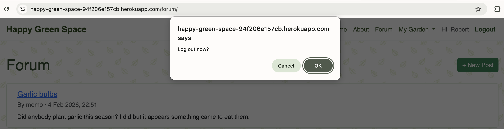

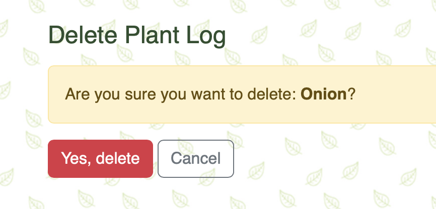

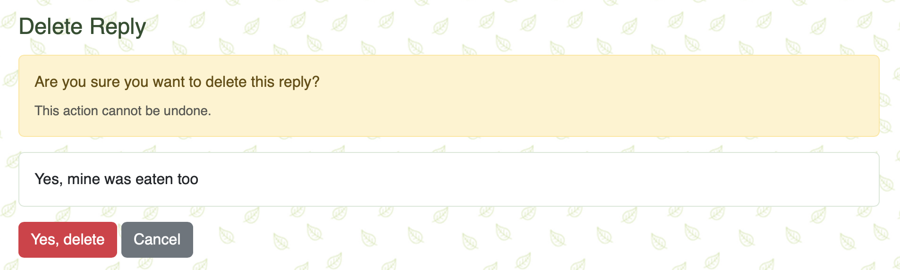

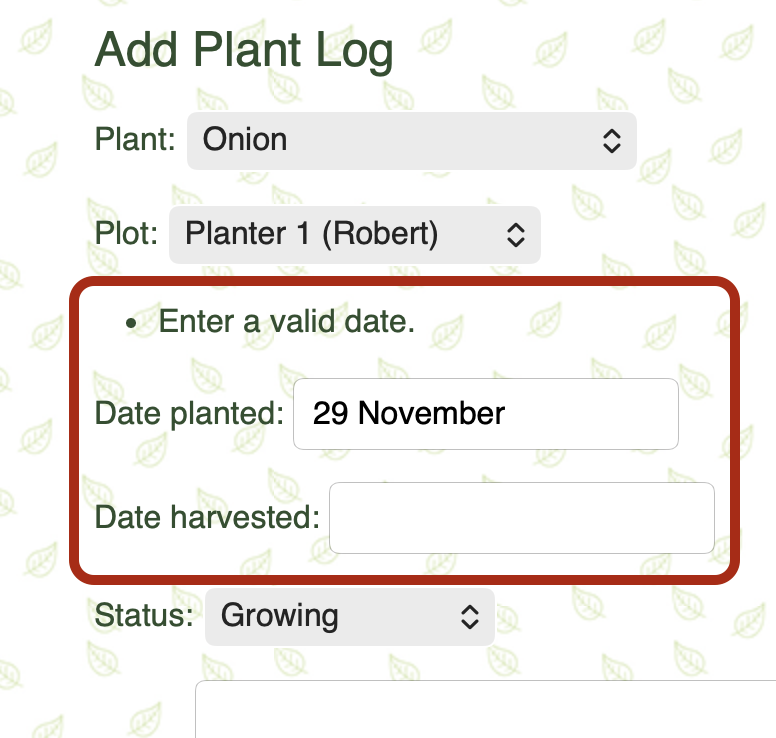

## Deploying the App on Heroku

### In the local project folder:

1.  Install `gunicorn` by running `pip install gunicorn~=20.1` from the terminal

2.  Add this installation to the requirements file by running `pip freeze --local > requirements.txt`

3.  Create a `Procfile` at the root directory of the project, declaring the process as `web` and adding a start command. The`Procfile` should then read `web: gunicorn happy_green_space.wsgi`

4.  In the `happy_green_space/settings.py` set the `DEBUG` constant to `False`. Append the `'.herokuapp.com'` hostname to the `ALLOWED_HOSTS` list.

5.  Update Git Repository

### In the Heroku account:

6.  In the Heroku account dashboard, create new app choosing Europe as the location.

    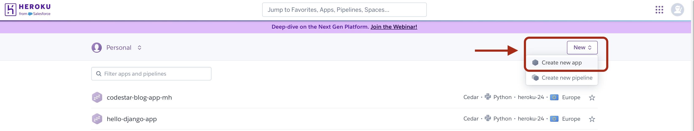

    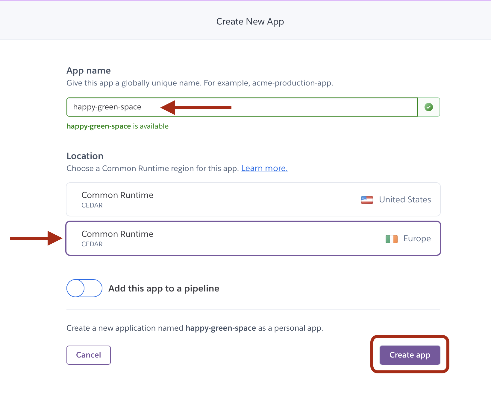

7.  From the `Settings`, `Config Vars` section, create a `key` of `DISABLE_COLLECTSTATIC` with `value` of `1`

    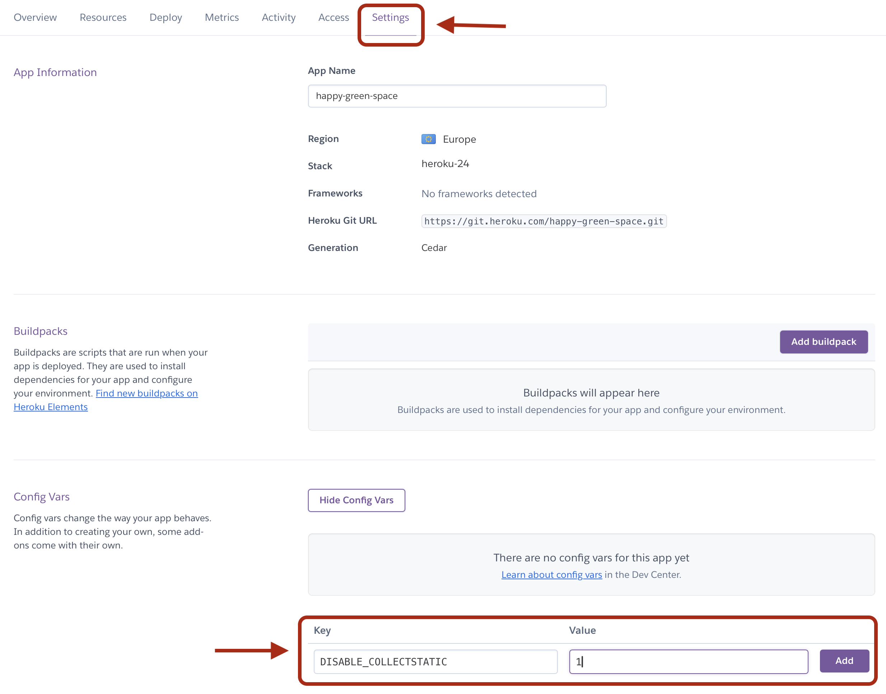

    **NOTE that although this setting may be useful in the initial development stage, it will need to be changed for correct css features to apply. See the subsection on "Static files" below.**

8.  In `Deploy`, after providing GitHub Repository details, click on `Deploy Branch` in the `Manual deploy` section.

    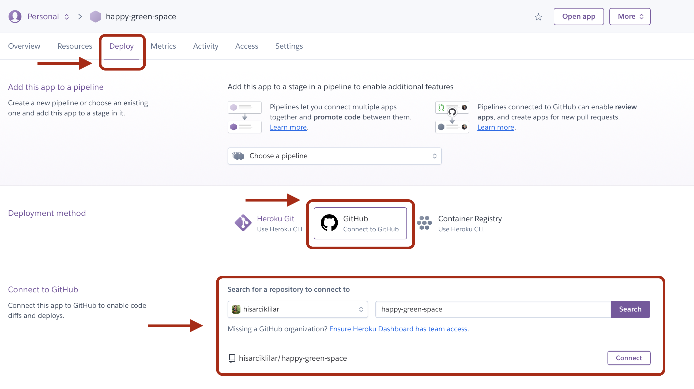

    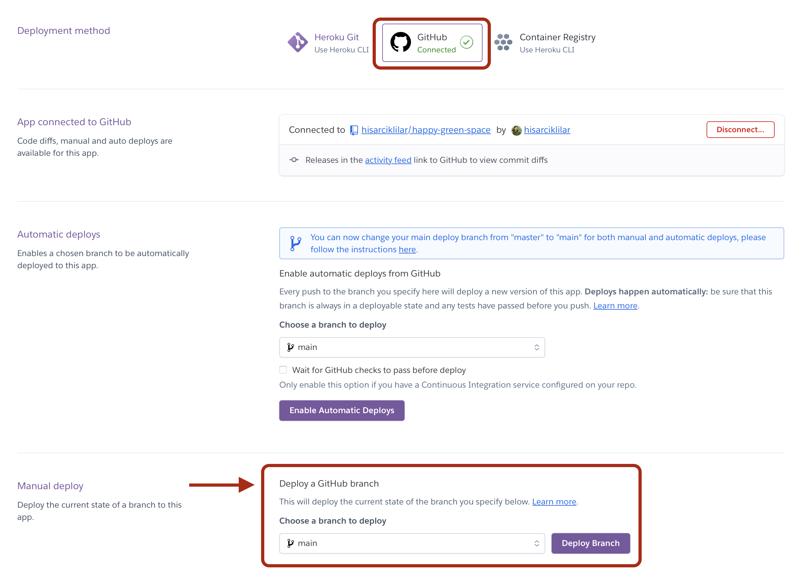

9.  You may view the page once the deployment is completed.

    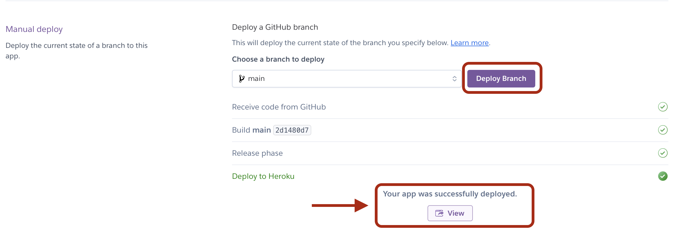

### Static Files (CSS, images) on Heroku

This project serves static assets (CSS, images) using Django’s staticfiles system with **Whitenoise**.

- Local development: Static assets live in the project `static/` folder:

  - `static/css/` (e.g. `static/css/style.css`)
  - `static/images/` (e.g. `static/images/leaves.png`)

- In the settings.py, the app is configured with:

  - `STATIC_URL = "static/"`
  - `STATICFILES_DIRS = [BASE_DIR / "static"]`

- Heroku runs `python manage.py collectstatic` on deployment and collects static files into `STATIC_ROOT = BASE_DIR / "staticfiles"` (set in the `settings.py`). Whitenoise serves them in production.

- Important rules:
  - `staticfiles/` is generated output of collecting static files. Do NOT edit files inside it
  - Add this folder to the `.gitignore`
  - Ensure the Heroku config var `DISABLE_COLLECTSTATIC` is not enabled at later stages of project. Otherwise, static assets will not be collected and served correctly. You may check this with `heroku config --app happy-green-space`
  - In CSS, prefer relative paths for images (e.g. `url("../images/leaves.png")`) to avoid issues in local development and production.

## Creating a Fork

On GitHub, users may fork this repository by navigating to "Fork" and selecting "Create a new fork". One cannot fork from their repository. Hence, below, a screenshot of how this could be done is provided using a repository created by a different user:

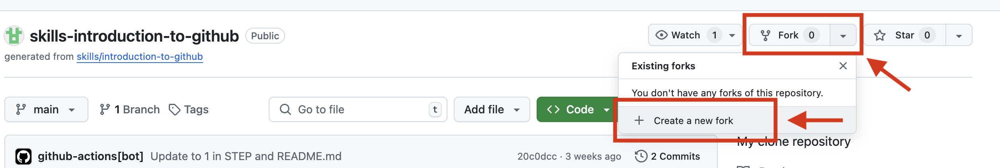

## Cloning a Repository

Users may clone this repository by navigating to "Code" and copying the clone link. This link can then be used in Gitpod or a local code editor. A screenshot of the links is provided below:

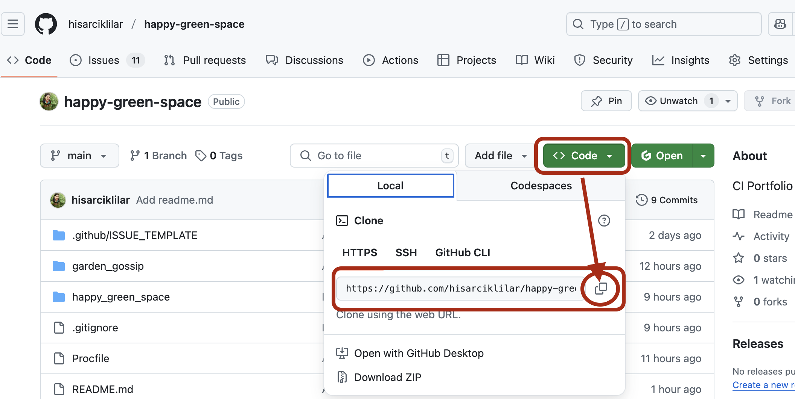

(Please note this is not the only way to clone a repository)

## Acknowledgements

- ChatGPT for error identification and potential solutions while working on the platform.
- ChatGPT for creation of text about tasks to undertake in January (`tasks_january.html`) file. 
- Leaves pattern used at the background is downloaded from <https://www.toptal.com/designers/subtlepatterns/leaves/>

## References
- Severence, C. (n.d.) Django for Everybody. Online course available from <https://www.dj4e.com>
- Vincent, W.S. (2025) Django for Beginners, 5th ed. Still River Press. 
- Vincent, W.S. (2025) Django for Professionals, 5th ed. Available from <https://learndjango.com/courses/django-for-professionals/> with subscription. 